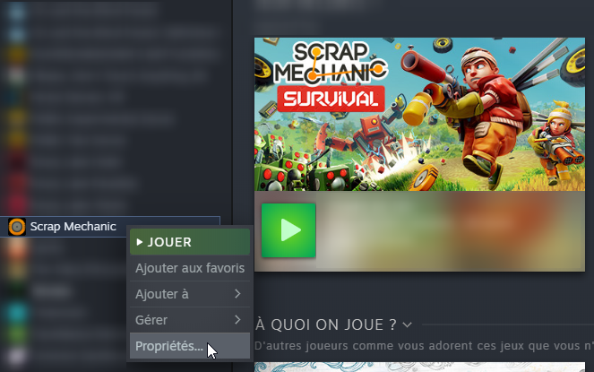
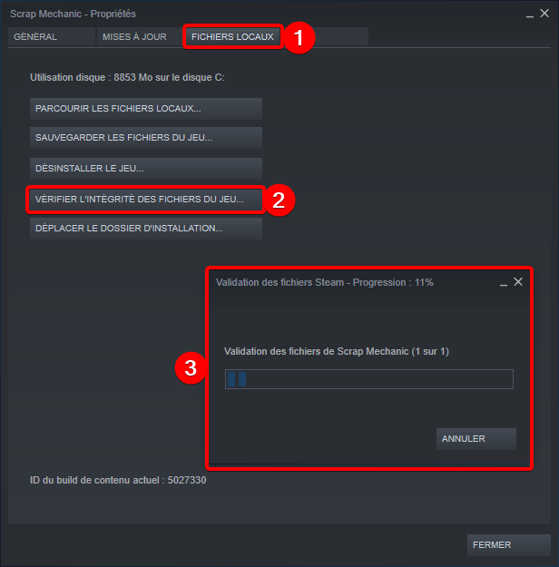

# EasySurvival Mod for Scrap Mechanic

This README is also available in [French](./README_FR.md)

 - **Current Mod version :** 0.2.2 [**Download**](https://github.com/RemiGascou/ScrapMechanic_EasySurvival/releases/download/0.2.2/EasySurvival_v0.2.2.zip)

 - **Compatible with :** ScrapMechanic 0.4.4 build 565 (latest version)

The purpose of this mod is to make the Survival mode of ScrapMechanic a bit easier and faster.

## Features

### Tools

 - **SledgeHammer God mode** : SledgeHammer is capable of destroying big trees and stones

### Interactables

 - **Refinery output (and refine by hand)** : was set to 10 blocks in the original game, the mod sets it to 256 blocks (a full stack)

### Harvestables loot

All harvestable items will give more loot than the original game, as shown in the following table :

| Harvestable              | Original Value | Mod Value         |
|--------------------------|----------------|-------------------|
| Bee Hive                 | 1 - 5          | Comming soon      |
| Cotton Plant             | 1              | 10                |
| Oil Geyser               | 1              | 20                |
| Pigment Flower           | 1              | 10                |
| Slimy Clam               | 1              | 10                |

You can change all these values in `C:\Program Files (x86)\Steam\steamapps\common\Scrap Mechanic\Mods\Mod_EasySurvival\mod_easysurvival.lua`

## Installing the Mod

To install thee mod, simply unzip the mod into your game folder. **Do not delete yours, just copy and replace files.**
You game folder is usually located at : `C:\Program Files (x86)\Steam\steamapps\common\Scrap Mechanic\`

## Uninstalling the Mod

To uninstall the mod, go to steam, right click on ScrapMechanic, then properties :

Then go to `Local files` and click on check game files integrity :

Steam will automatically replace the files you changed when installing the mod.
